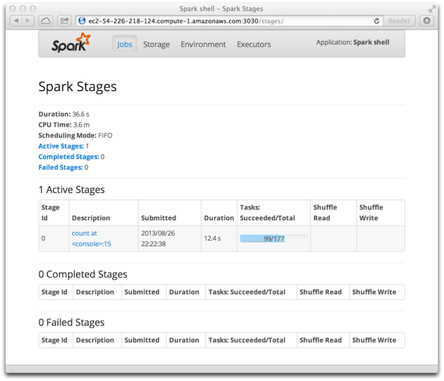
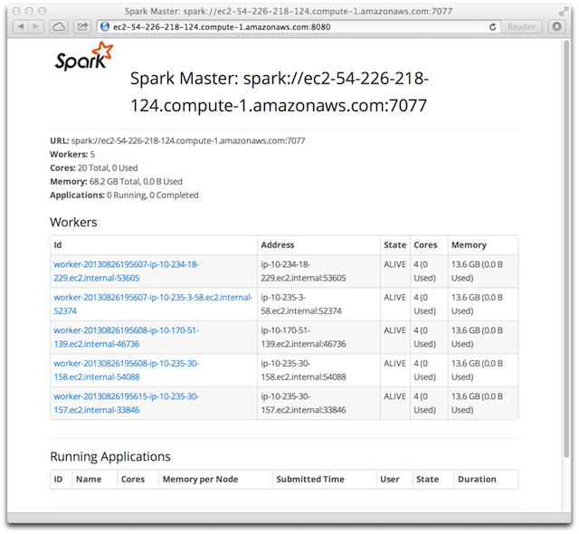

In this chapter, we will first use the Spark shell to interactively explore the Wikipedia data.
Then, we will give a brief introduction to writing standalone Spark programs. Remember, Spark is an open source computation engine built on top of the popular Hadoop Distributed File System (HDFS).

## Interactive Analysis

Let's now use Spark to do some order statistics on the data set.
First, launch the Spark shell:

<pre class="prettyprint lang-bsh">
/root/spark/spark-shell</pre>

<pre class="prettyprint lang-bsh">
/root/spark/pyspark</pre>

The prompt should appear within a few seconds. __Note:__ You may need to hit `[Enter]` once to clear the log output.

1. Warm up by creating an RDD (Resilient Distributed Dataset) named `pagecounts` from the input files.
   In the Spark shell, the SparkContext is already created for you as variable `sc`.

   

     

       scala> sc
       res: spark.SparkContext = spark.SparkContext@470d1f30

       scala> val pagecounts = sc.textFile("/wiki/pagecounts")
       12/08/17 23:35:14 INFO mapred.FileInputFormat: Total input paths to process : 74
       pagecounts: spark.RDD[String] = MappedRDD[1] at textFile at <console>:12
     

     

       >>> sc
       <pyspark.context.SparkContext object at 0x7f7570783350>
       >>> pagecounts = sc.textFile("/wiki/pagecounts")
       13/02/01 05:30:43 INFO mapred.FileInputFormat: Total input paths to process : 74
       >>> pagecounts
       <pyspark.rdd.RDD object at 0x217d510>
     

   

2. Let's take a peek at the data. You can use the take operation of an RDD to get the first K records. Here, K = 10.

   

   

       scala> pagecounts.take(10)
       ...
       res: Array[String] = Array(20090505-000000 aa.b ?71G4Bo1cAdWyg 1 14463, 20090505-000000 aa.b Special:Statistics 1 840, 20090505-000000 aa.b Special:Whatlinkshere/MediaWiki:Returnto 1 1019, 20090505-000000 aa.b Wikibooks:About 1 15719, 20090505-000000 aa ?14mFX1ildVnBc 1 13205, 20090505-000000 aa ?53A%2FuYP3FfnKM 1 13207, 20090505-000000 aa ?93HqrnFc%2EiqRU 1 13199, 20090505-000000 aa ?95iZ%2Fjuimv31g 1 13201, 20090505-000000 aa File:Wikinews-logo.svg 1 8357, 20090505-000000 aa Main_Page 2 9980)
   

   

       >>> pagecounts.take(10)
       ...
       [u'20090505-000000 aa.b ?71G4Bo1cAdWyg 1 14463', u'20090505-000000 aa.b Special:Statistics 1 840', u'20090505-000000 aa.b Special:Whatlinkshere/MediaWiki:Returnto 1 1019', u'20090505-000000 aa.b Wikibooks:About 1 15719', u'20090505-000000 aa ?14mFX1ildVnBc 1 13205', u'20090505-000000 aa ?53A%2FuYP3FfnKM 1 13207', u'20090505-000000 aa ?93HqrnFc%2EiqRU 1 13199', u'20090505-000000 aa ?95iZ%2Fjuimv31g 1 13201', u'20090505-000000 aa File:Wikinews-logo.svg 1 8357', u'20090505-000000 aa Main_Page 2 9980']
   

   

   Unfortunately this is not very readable because `take()` returns an array and Scala simply prints the array with each element separated by a comma.
   We can make it prettier by traversing the array to print each record on its own line.

   

   

       scala> pagecounts.take(10).foreach(println)
       ...
       20090505-000000 aa.b ?71G4Bo1cAdWyg 1 14463
       20090505-000000 aa.b Special:Statistics 1 840
       20090505-000000 aa.b Special:Whatlinkshere/MediaWiki:Returnto 1 1019
       20090505-000000 aa.b Wikibooks:About 1 15719
       20090505-000000 aa ?14mFX1ildVnBc 1 13205
       20090505-000000 aa ?53A%2FuYP3FfnKM 1 13207
       20090505-000000 aa ?93HqrnFc%2EiqRU 1 13199
       20090505-000000 aa ?95iZ%2Fjuimv31g 1 13201
       20090505-000000 aa File:Wikinews-logo.svg 1 8357
       20090505-000000 aa Main_Page 2 9980
   

   

       >>> for x in pagecounts.take(10):
       ...    print x
       ...
       20090505-000000 aa.b ?71G4Bo1cAdWyg 1 14463
       20090505-000000 aa.b Special:Statistics 1 840
       20090505-000000 aa.b Special:Whatlinkshere/MediaWiki:Returnto 1 1019
       20090505-000000 aa.b Wikibooks:About 1 15719
       20090505-000000 aa ?14mFX1ildVnBc 1 13205
       20090505-000000 aa ?53A%2FuYP3FfnKM 1 13207
       20090505-000000 aa ?93HqrnFc%2EiqRU 1 13199
       20090505-000000 aa ?95iZ%2Fjuimv31g 1 13201
       20090505-000000 aa File:Wikinews-logo.svg 1 8357
       20090505-000000 aa Main_Page 2 9980
   

   

2. Let's see how many records in total are in this data set (this command will take a while, so read ahead while it is running).

   

   

       scala> pagecounts.count
   

   

       >>> pagecounts.count()
   

   

   This should launch 177 Spark tasks on the Spark cluster.
   If you look closely at the terminal, the console log is pretty chatty and tells you the progress of the tasks.
   Because we are reading 20G of data from HDFS, this task is I/O bound and can take a while to scan through all the data (2 - 3 mins).

   While it's running, you can open the Spark web console to see the progress.
   To do this, open your favorite browser, and type in the following URL.

   `http://<master_node_hostname>:3030`

   You should have been given `master_node_hostname` at the beginning of the
   tutorial, or you might have [launched your own
   cluster](launching-a-cluster.html) and made a note of it then. You should
   see the Spark application status web interface, similar to the following:

   

   The links in this interface allow you to track the job's progress and
   various metrics about its execution, including task durations and cache
   statistics.

   In addition, the Spark Standalone cluster status web interface displays
   information that pertains to the entire Spark cluster.  To view this UI,
   browse to

   `http://<master_node_hostname>:8080`

   You should see a page similar to the following (yours will probably show five slaves):

   

   When your query finishes running, it should return the following count:

       329641466

4. Recall from above when we described the format of the data set, that the second field is the "project code" and contains information about the language of the pages.
   For example, the project code "en" indicates an English page.
   Let's derive an RDD containing only English pages from `pagecounts`.
   This can be done by applying a filter function to `pagecounts`.
   For each record, we can split it by the field delimiter (i.e. a space) and get the second field-– and then compare it with the string "en".

   To avoid reading from disks each time we perform any operations on the RDD, we also __cache the RDD into memory__.
    This is where Spark really starts to to shine.

   

   

       scala> val enPages = pagecounts.filter(_.split(" ")(1) == "en").cache
       enPages: spark.RDD[String] = FilteredRDD[2] at filter at <console>:14
   

   

       >>> enPages = pagecounts.filter(lambda x: x.split(" ")[1] == "en").cache()
   

   

   When you type this command into the Spark shell, Spark defines the RDD, but because of lazy evaluation, no computation is done yet.
   Next time any action is invoked on `enPages`, Spark will cache the data set in memory across the 5 slaves in your cluster.

5. How many records are there for English pages?

   

   

       scala> enPages.count
       ...
       res: Long = 122352588
   

   

       >>> enPages.count()
       ...
       122352588
   

   

   The first time this command is run, similar to the last count we did, it will take 2 - 3 minutes while Spark scans through the entire data set on disk.
   __But since enPages was marked as "cached" in the previous step, if you run count on the same RDD again, it should return an order of magnitude faster__.

   If you examine the console log closely, you will see lines like this, indicating some data was added to the cache:

       13/02/05 20:29:01 INFO storage.BlockManagerMasterActor$BlockManagerInfo: Added rdd_2_172 in memory on ip-10-188-18-127.ec2.internal:42068 (size: 271.8 MB, free: 5.5 GB)

6. Let's try something fancier.
   Generate a histogram of total page views on Wikipedia English pages for the date range represented in our dataset (May 5 to May 7, 2009).
   The high level idea of what we'll be doing is as follows.
   First, we generate a key value pair for each line; the key is the date (the first eight characters of the first field), and the value is the number of pageviews for that date (the fourth field).

   

   

       scala> val enTuples = enPages.map(line => line.split(" "))
       enTuples: spark.RDD[Array[java.lang.String]] = MappedRDD[3] at map at <console>:16

       scala> val enKeyValuePairs = enTuples.map(line => (line(0).substring(0, 8), line(3).toInt))
       enKeyValuePairs: spark.RDD[(java.lang.String, Int)] = MappedRDD[4] at map at <console>:18
   

   

       >>> enTuples = enPages.map(lambda x: x.split(" "))
       >>> enKeyValuePairs = enTuples.map(lambda x: (x[0][:8], int(x[3])))
   

   

   Next, we shuffle the data and group all values of the same key together.
   Finally we sum up the values for each key.
   There is a convenient method called `reduceByKey` in Spark for exactly this pattern.
   Note that the second argument to `reduceByKey` determines the number of reducers to use.
   By default, Spark assumes that the reduce function is commutative and associative and applies combiners on the mapper side.
   Since we know there is a very limited number of keys in this case (because there are only 3 unique dates in our data set), let's use only one reducer.

   

   

       scala> enKeyValuePairs.reduceByKey(_+_, 1).collect
       ...
       res: Array[(java.lang.String, Int)] = Array((20090506,204190442), (20090507,202617618), (20090505,207698578))

     The `collect` method at the end converts the result from an RDD to an array.
     Note that when we don't specify a name for the result of a command (e.g. `val enTuples` above), a variable with name `res`<i>N</i> is automatically created.
   

   

       >>> enKeyValuePairs.reduceByKey(lambda x, y: x + y, 1).collect()
       ...
       [(u'20090506', 204190442), (u'20090507', 202617618), (u'20090505', 207698578)]

     The `collect` method at the end converts the result from an RDD to an array.
   

   

   We can combine the previous three commands into one:

   

   

       scala> enPages.map(line => line.split(" ")).map(line => (line(0).substring(0, 8), line(3).toInt)).reduceByKey(_+_, 1).collect
       ...
       res: Array[(java.lang.String, Int)] = Array((20090506,204190442), (20090507,202617618), (20090505,207698578))
   

   

       >>> enPages.map(lambda x: x.split(" ")).map(lambda x: (x[0][:8], int(x[3]))).reduceByKey(lambda x, y: x + y, 1).collect()
       ...
       [(u'20090506', 204190442), (u'20090507', 202617618), (u'20090505', 207698578)]
   

   

7. Suppose we want to find pages that were viewed more than 200,000 times during the three days covered by our dataset.
   Conceptually, this task is similar to the previous query.
   But, given the large number of pages (23 million distinct page names), the new task is very expensive.
   We are doing an expensive group-by with a lot of network shuffling of data.

   To recap, first we split each line of data into its respective fields.
   Next, we extract the fields for page name and number of page views.
   We reduce by key again, this time with 40 reducers.
   Then we filter out pages with less than 200,000 total views over our time window represented by our dataset.

   

   

       scala> enPages.map(l => l.split(" ")).map(l => (l(2), l(3).toInt)).reduceByKey(_+_, 40).filter(x => x._2 > 200000).map(x => (x._2, x._1)).collect.foreach(println)
       (203378,YouTube)
       (17657352,Special:Search)
       (311465,Special:Watchlist)
       (248624,Special:Export)
       (237677,2009_swine_flu_outbreak)
       (396776,Dom_DeLuise)
       (5816953,Special:Random)
       (18730347,Main_Page)
       (534253,Swine_influenza)
       (310642,index.html)
       (464935,Wiki)
       (382510,Deadpool_(comics))
       (3521336,Special:Randompage)
       (204604,X-Men_Origins:_Wolverine)
       (695817,Cinco_de_Mayo)
       (317708,The_Beatles)
       (234855,Scrubs_(TV_series))
       (43822489,404_error/)
   

   

       >>> enPages.map(lambda x: x.split(" ")).map(lambda x: (x[2], int(x[3]))).reduceByKey(lambda x, y: x + y, 40).filter(lambda x: x[1] > 200000).map(lambda x: (x[1], x[0])).collect()
       [(5816953, u'Special:Random'), (18730347, u'Main_Page'), (534253, u'Swine_influenza'), (382510, u'Deadpool_(comics)'), (204604, u'X-Men_Origins:_Wolverine'), (203378, u'YouTube'), (43822489, u'404_error/'), (234855, u'Scrubs_(TV_series)'), (248624, u'Special:Export'), (695817, u'Cinco_de_Mayo'), (311465, u'Special:Watchlist'), (396776, u'Dom_DeLuise'), (310642, u'index.html'), (317708, u'The_Beatles'), (237677, u'2009_swine_flu_outbreak'), (3521336, u'Special:Randompage'), (464935, u'Wiki'), (17657352, u'Special:Search')]
   

   

   There is no hard and fast way to calculate the optimal number of reducers for a given problem; you will
   build up intuition over time by experimenting with different values.

   To leave the Spark shell, type `exit` at the prompt.

8. You can explore the full RDD API by browsing the [Java/Scala](http://www.cs.berkeley.edu/~pwendell/strataconf/api/core/index.html#spark.RDD) or [Python](http://www.cs.berkeley.edu/~pwendell/strataconf/api/pyspark/index.html) API docs.

## Running Standalone Spark Programs

Because of time constraints, in this tutorial we focus on ad-hoc style analytics using the Spark shell.
However, for many tasks, it makes more sense to write a standalone Spark program.
We will return to this in the section on Spark Streaming below, where you will actually write a standalone Spark Streaming job.
We aren't going to cover how to structure, build, and run standalone Spark jobs here, but before we move on, we list here a few resources about standalone Spark jobs for you to come back and explore later.

First, on the AMI for this tutorial we have included "template" projects for Scala and Java standalone programs for both Spark and Spark streaming.
The Spark ones can be found in the `/root/scala-app-template` and `/root/java-app-template` directories (we will discuss the Streaming ones later).
Feel free to browse through the contents of those directories. You can also find examples of building and running Spark standalone jobs <a href="http://www.spark-project.org/docs/latest/quick-start.html#a-standalone-job-in-java">in Java</a> and <a href="http://www.spark-project.org/docs/latest/quick-start.html#a-standalone-job-in-scala">in Scala</a> as part of the Spark Quick Start Guide. For even more details, see Matei Zaharia's <a href="http://ampcamp.berkeley.edu/wp-content/uploads/2012/06/matei-zaharia-part-2-amp-camp-2012-standalone-programs.pdf" target="_blank">slides</a> and <a href="http://www.youtube.com/watch?v=7k4yDKBYOcw&t=59m37s" target="_blank">talk video</a> about Standalone Spark jobs at the <a href="http://ampcamp.berkeley.edu/agenda-2012" target="blank">first AMP Camp</a>.
