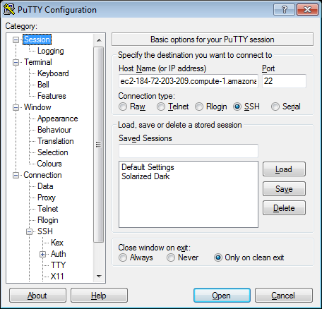
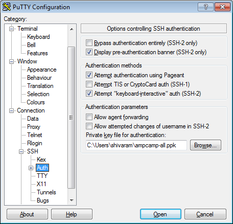

Let's log into your cluster. Note, if you are <em>not attending the training in person</em> you need to launch your own cluster, so if you haven't done that yet [go do it now](launching-a-bdas-cluster-on-ec2.html).

First, click the tab below that corresponds to the operating system you are running to find instructions for SSH-ing into your cluster on EC2.

<ul class="nav nav-tabs" data-tabs="tabs">
  <li class="active"><a data-toggle="tab" href="#login_linux">Linux, Cygwin, or OS X</a></li>
  <li><a data-toggle="tab" href="#login_windows">Windows</a></li>
</ul>

Log into your cluster via

    ssh -i <key_file> root@<master_node_hostname>

where `key_file` here is the private AWS EC2 keyfile.

__Question: I got the following permission error when I ran the above command. Help!__

<pre class="nocode">
@@@@@@@@@@@@@@@@@@@@@@@@@@@@@@@@@@@@@@@@@@@@@@@@@@@@@@@@@@@
@             WARNING: UNPROTECTED PRIVATE KEY FILE!              @
@@@@@@@@@@@@@@@@@@@@@@@@@@@@@@@@@@@@@@@@@@@@@@@@@@@@@@@@@@@
Permissions 0644 for '../ampcamp.pem' are too open.
It is recommended that your private key files are NOT accessible by others.
This private key will be ignored.
bad permissions: ignore key: ../ampcamp.pem
Permission denied (publickey).
</pre>

__Answer:__ Run this command, then try to log in again:

    chmod 600 ../ampcamp.pem

You can use [PuTTY](http://www.putty.org/) to log into the cluster from Windows.

1. Download PuTTY from [here](http://the.earth.li/~sgtatham/putty/latest/x86/putty.exe).

2. Start PuTTY and enter the hostname that was mailed to you, as shown in the screenshot below.

   

3. Click on Connection > Data in the Category area and enter `root` as the username

   

4. Click on Connection > SSH > Auth in the Category area and enter the path to the private key file (`ampcamp-all.ppk`) that was sent to you by mail.

   

5. Click on Open

