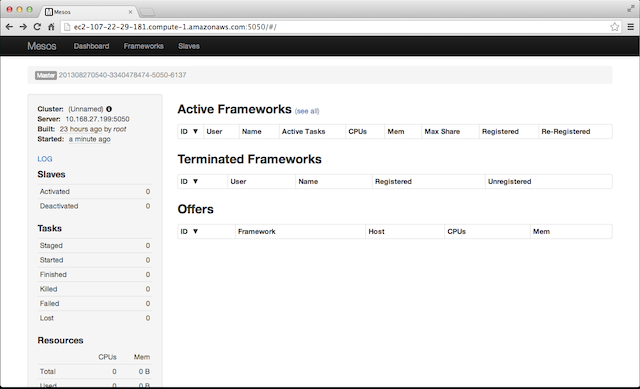
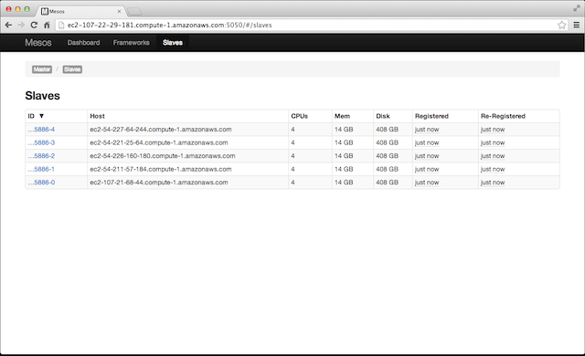
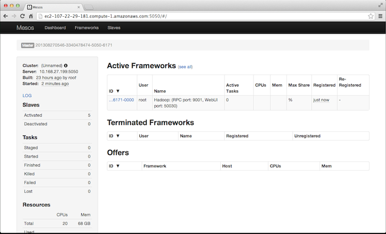
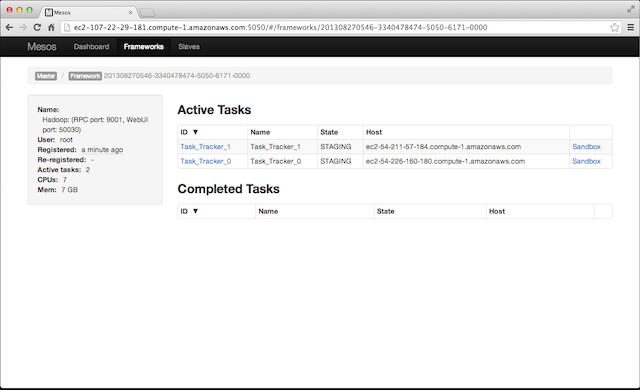
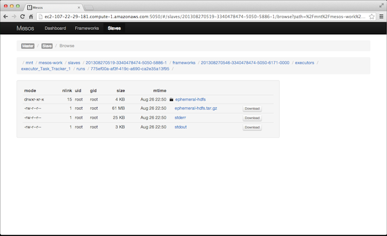
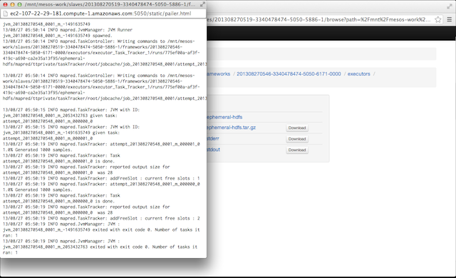
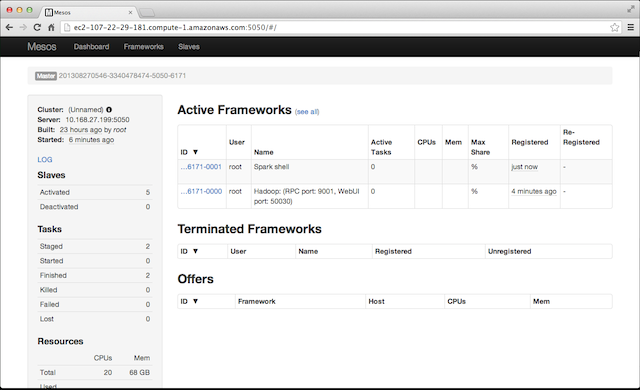
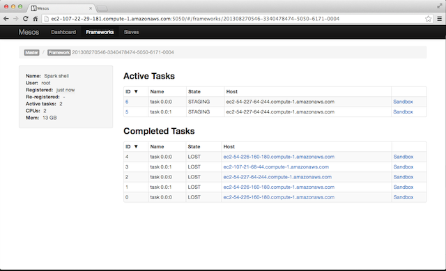
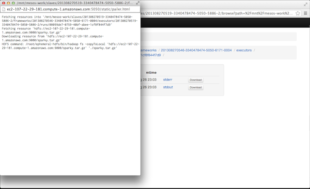
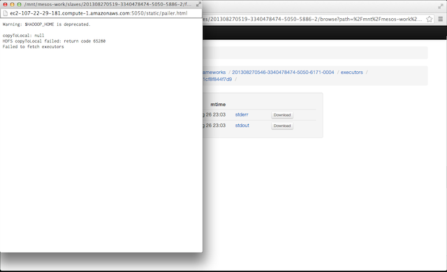

Apache Mesos is a cluster manager that makes building and running
distributed systems, or _frameworks_, easy and efficient. Using Mesos
you can simultaneously run Apache Hadoop, Apache Spark, Apache Storm,k
and many other applications on a dynamically shared pool of resources
(machines).

Mesos itself is a distributed system made up of _masters_ and
_slaves_. You should have been given `master_node_hostname` at the
beginning of this training, or you might have [launched your own
cluster](launching-a-spark-shark-cluster-on-ec2.html) and made a note
of it then.

Let's start by logging into `master_node_hostname`:

<pre class="prettyprint lang-bsh">
$ ssh -i /path/to/ampcamp3-all.pem root@master_node_hostname</pre>

### Command Line Flags ###

The master and slaves can be configured using command line
flags. There is not a configuration file for Mesos, but any command
line flag can be passed via an environment variable prefixed with
`MESOS_`.

1. Use `--help` to see the available flags:

   <pre class="prettyprint lang-bsh">
   $ mesos-master --help</pre>

   

   <pre>
   Usage: mesos-master [...]

   Supported options:
     --allocation_interval=VALUE     Amount of time to wait between performing
                                      (batch) allocations (e.g., 500ms, 1sec, etc) (default: 1secs)
     --cluster=VALUE                 Human readable name for the cluster,
                                     displayed in the webui
     --framework_sorter=VALUE        Policy to use for allocating resources
                                     between a given user's frameworks. Options
                                     are the same as for user_allocator (default: drf)
     --[no-]help                     Prints this help message (default: false)
     --ip=VALUE                      IP address to listen on
     --log_dir=VALUE                 Location to put log files (no default, nothing
                                     is written to disk unless specified;
                                     does not affect logging to stderr)
     --logbufsecs=VALUE              How many seconds to buffer log messages for (default: 0)
     --port=VALUE                    Port to listen on (default: 5050)
     --[no-]quiet                    Disable logging to stderr (default: false)
     --roles=VALUE                   A comma seperated list of the allocation
                                     roles that frameworks in this cluster may
                                     belong to.
     --[no-]root_submissions         Can root submit frameworks? (default: true)
     --slaves=VALUE                  Initial slaves that should be
                                     considered part of this cluster
                                     (or if using ZooKeeper a URL) (default: *)
     --user_sorter=VALUE             Policy to use for allocating resources
                                     between users. May be one of:
                                       dominant_resource_fairness (drf) (default: drf)
     --webui_dir=VALUE               Location of the webui files/assets (default: /usr/local/share/mesos/webui)
     --weights=VALUE                 A comma seperated list of role/weight pairs
                                     of the form 'role=weight,role=weight'. Weights
                                     are used to indicate forms of priority.
     --whitelist=VALUE               Path to a file with a list of slaves
                                     (one per line) to advertise offers for;
                                     should be of the form: file://path/to/file (default: *)
     --zk=VALUE                      ZooKeeper URL (used for leader election amongst masters)
                                     May be one of:
                                       zk://host1:port1,host2:port2,.../path
                                       zk://username:password@host1:port1,host2:port2,.../path
                                       file://path/to/file (where file contains one of the above) (default: )</pre>
   

   <pre class="prettyprint lang-bsh">
   $ mesos-slave --help</pre>

   

   <pre>
   Usage: mesos-slave [...]

   Supported options:
     --attributes=VALUE                         Attributes of machine
     --[no-]checkpoint                          Whether to checkpoint slave and frameworks information
                                                to disk. This enables a restarted slave to recover
                                                status updates and reconnect with (--recover=reconnect) or
                                                kill (--recover=kill) old executors (default: false)
     --default_role=VALUE                       Any resources in the --resources flag that
                                                omit a role, as well as any resources that
                                                are not present in --resources but that are
                                                automatically detected, will be assigned to
                                                this role. (default: *)
     --disk_watch_interval=VALUE                Periodic time interval (e.g., 10secs, 2mins, etc)
                                                to check the disk usage (default: 1mins)
     --executor_registration_timeout=VALUE      Amount of time to wait for an executor
                                                to register with the slave before considering it hung and
                                                shutting it down (e.g., 60secs, 3mins, etc) (default: 1mins)
     --executor_shutdown_grace_period=VALUE     Amount of time to wait for an executor
                                                to shut down (e.g., 60secs, 3mins, etc) (default: 5secs)
     --frameworks_home=VALUE                    Directory prepended to relative executor URIs (default: )
     --gc_delay=VALUE                           Maximum amount of time to wait before cleaning up
                                                executor directories (e.g., 3days, 2weeks, etc).
                                                Note that this delay may be shorter depending on
                                                the available disk usage. (default: 1weeks)
     --hadoop_home=VALUE                        Where to find Hadoop installed (for
                                                fetching framework executors from HDFS)
                                                (no default, look for HADOOP_HOME in
                                                environment or find hadoop on PATH) (default: )
     --[no-]help                                Prints this help message (default: false)
     --ip=VALUE                                 IP address to listen on
     --isolation=VALUE                          Isolation mechanism, may be one of: process, cgroups (default: process)
     --launcher_dir=VALUE                       Location of Mesos binaries (default: /usr/local/libexec/mesos)
     --log_dir=VALUE                            Location to put log files (no default, nothing
                                                is written to disk unless specified;
                                                does not affect logging to stderr)
     --logbufsecs=VALUE                         How many seconds to buffer log messages for (default: 0)
     --master=VALUE                             May be one of:
                                                  zk://host1:port1,host2:port2,.../path
                                                  zk://username:password@host1:port1,host2:port2,.../path
                                                  file://path/to/file (where file contains one of the above)
     --port=VALUE                               Port to listen on (default: 5051)
     --[no-]quiet                               Disable logging to stderr (default: false)
     --recover=VALUE                            Whether to recover status updates and reconnect with old executors.
                                                Valid values for 'recover' are
                                                reconnect: Reconnect with any old live executors.
                                                cleanup  : Kill any old live executors and exit.
                                                           Use this option when doing an incompatible slave
                                                           or executor upgrade!).
                                                NOTE: If checkpointed slave doesn't exist, no recovery is performed
                                                      and the slave registers with the master as a new slave. (default: reconnect)
     --resource_monitoring_interval=VALUE       Periodic time interval for monitoring executor
                                                resource usage (e.g., 10secs, 1min, etc) (default: 5secs)
     --resources=VALUE                          Total consumable resources per slave, in
                                                the form 'name(role):value;name(role):value...'.
     --[no-]strict                              If strict=true, any and all recovery errors are considered fatal.
                                                If strict=false, any expected errors (e.g., slave cannot recover
                                                information about an executor, because the slave died right before
                                                the executor registered.) during recovery are ignored and as much
                                                state as possible is recovered.
                                                (default: false)
     --[no-]switch_user                         Whether to run tasks as the user who
                                                submitted them rather than the user running
                                                the slave (requires setuid permission) (default: true)
     --work_dir=VALUE                           Where to place framework work directories
                                                (default: /tmp/mesos)</pre>
   

------------------------------------------------------------------------

### Web Interface ###

A web interface is available on the master. The default master port is
`5050` (which can be changed via the `--port` option). _Note that the
port used for the web interface **is the same** port used by the
slaves to connect to the master!_

1. Open your favorite browser and go to
`http://<master_node_hostname>:5050`:

   

   
   

2. Without any frameworks running, the only thing interesting is the
connected slaves. Click `Slaves` in the top navigation bar:

   

   
   

**NOTE:** _The web interface updates automagically so don't bother
refreshing it or closing the window as we'll use it throughout this
training._

------------------------------------------------------------------------

### High Availability ###

Multiple masters can be run simultaneously in order to provide high
availability (i.e., if one master fails, another will take over). The
current implementation relies on Apache ZooKeeper to perform leader
election between the masters. Slaves use ZooKeeper to find the leading
master as well. To start a master that uses ZooKeeper use the `--zk`
option:

<pre>
--zk=VALUE                      ZooKeeper URL (used for leader election amongst masters)
                                May be one of:
                                  zk://host1:port1,host2:port2,.../path
                                  zk://username:password@host1:port1,host2:port2,.../path
                                  file://path/to/file (where file contains one of the above) (default: )</pre>

To start a slave that uses ZooKeeper to determine the leading master
use the `--master` option:

<pre>
--master=VALUE                             May be one of:
                                             zk://host1:port1,host2:port2,.../path
                                             zk://username:password@host1:port1,host2:port2,.../path
                                             file://path/to/file (where file contains one of the above)</pre>

**NOTE:** _Use_ `file://` _when you want to use authentication (i.e.,_
`username:password`_) but don't want to reveal any secrets on the
command line (or in the environment)!_

We've already launched a ZooKeeper cluster for you and started the
slaves with ZooKeeper. But let's simulate a master failover!

1. Kill the running master:

   <pre class="prettyprint lang-bsh">
   $ killall mesos-master</pre>

   If you didn't close your browser window, switch to it now:

   

   
   

2. Restart the master with the `--zk` option:

   <pre class="prettyprint lang-bsh">
   $ nohup mesos-master --zk=zk://master_node_hostname:2181/mesos </dev/null >/dev/null 2>&1 &</pre>

   After the web interfaces refreshes you should see all of the slaves
   re-registered.

**NOTE:** _You can leverage the high availability of Mesos to perform
backwards compatible upgrades without any downtime!_

------------------------------------------------------------------------

### Logs ###

By default, _a Mesos master and slave log to standard error_. You can
additionally log to the filesystem by setting the `--log_dir` option:

<pre>
--log_dir=VALUE                 Location to put log files (no default, nothing
                                is written to disk unless specified;</pre>

1. Browse back to the "home" page (hit back or click `Mesos` in the
upper left corner) the to your browser and click on the `LOG` link in
the left hand column:

   

   
   

   Ah ha! Close the popup window and let's restart the master using
   the `--log_dir` option:

   <pre class="prettyprint lang-bsh">
   $ killall mesos-master
   $ nohup mesos-master --zk=zk://master_node_hostname:2181/mesos --log_dir=/mnt/mesos-logs </dev/null >/dev/null 2>&1 &</pre>

   Now click on the `LOG` link again:

   

   
   

**NOTE:** _The web interface is simply paging/tailing the logs from_
`/mnt/mesos-logs/mesos-master.INFO`_, which you can do as well using_
`tail` _and/or_ `less`_._

------------------------------------------------------------------------

### REST Interface ###

The Mesos masters and slaves provide a handful of REST endpoints that
can be useful for users and operators. A collection of "help" pages
are available for some of them (our version of `man` for REST).

1. Go to `http://<master_node_hostname>:5050/help` in your browser to
see all of the available endpoints:

   

   
   

2. You can get more details about an endpoint or nested endpoints by
clicking on one; click on `/logging`:

   

   
   

3. Now click on `/logging/toggle` to see the help page:

   

   
   

4. Let's toggle the verbosity level of the master:

   <pre class="prettyprint lang-bsh">
   $ curl 'http://master_node_hostname:5050/logging/toggle?level=3&duration=1mins'</pre>

   If you switch to (or reopen) the `LOG` popup window you should see
   a lot more output now (but only for another minute!).

5. The web interface uses the REST endpoints exclusively; for example,
to get the current "state" of a Mesos cluster (in JSON):

   <pre class="prettyprint lang-bsh">
   $ curl `http://master_node_hostname:5050/master/state.json` | python -mjson.tool</pre>

   

   <pre class="prettyprint lang-js">
   {
       "activated_slaves": 5,
       "build_date": "2013-08-26 06:41:22",
       "build_time": 1377499282,
       "build_user": "root",
       "completed_frameworks": [],
       "deactivated_slaves": 0,
       "failed_tasks": 0,
       "finished_tasks": 0,
       "frameworks": [],
       "id": "201308280103-3340478474-5050-8366",
       "killed_tasks": 0,
       "leader": "master@10.168.27.199:5050",
       "log_dir": "/mnt/mesos-logs",
       "lost_tasks": 0,
       "pid": "master@10.168.27.199:5050",
       "slaves": [
           {
               "attributes": {},
               "hostname": "ec2-54-226-160-180.compute-1.amazonaws.com",
               "id": "201308270519-3340478474-5050-5886-2",
               "pid": "slave(1)@10.235.1.38:5051",
               "registered_time": 1377651804.00701,
               "reregistered_time": 1377651804.00703,
               "resources": {
                   "cpus": 4,
                   "disk": 418176,
                   "mem": 13960,
                   "ports": "[31000-32000]"
               }
           },
           {
               "attributes": {},
               "hostname": "ec2-107-21-68-44.compute-1.amazonaws.com",
               "id": "201308270519-3340478474-5050-5886-0",
               "pid": "slave(1)@10.182.129.12:5051",
               "registered_time": 1377651804.00682,
               "reregistered_time": 1377651804.00682,
               "resources": {
                   "cpus": 4,
                   "disk": 418176,
                   "mem": 13960,
                   "ports": "[31000-32000]"
               }
           },
           {
               "attributes": {},
               "hostname": "ec2-54-227-64-244.compute-1.amazonaws.com",
               "id": "201308270519-3340478474-5050-5886-4",
               "pid": "slave(1)@10.235.48.134:5051",
               "registered_time": 1377651804.0065899,
               "reregistered_time": 1377651804.0065999,
               "resources": {
                   "cpus": 4,
                   "disk": 418176,
                   "mem": 13960,
                   "ports": "[31000-32000]"
               }
           },
           {
               "attributes": {},
               "hostname": "ec2-54-211-57-184.compute-1.amazonaws.com",
               "id": "201308270519-3340478474-5050-5886-1",
               "pid": "slave(1)@10.181.139.99:5051",
               "registered_time": 1377651804.00635,
               "reregistered_time": 1377651804.0063601,
               "resources": {
                   "cpus": 4,
                   "disk": 418176,
                   "mem": 13960,
                   "ports": "[31000-32000]"
               }
           },
           {
               "attributes": {},
               "hostname": "ec2-54-221-25-64.compute-1.amazonaws.com",
               "id": "201308270519-3340478474-5050-5886-3",
               "pid": "slave(1)@10.181.142.211:5051",
               "registered_time": 1377651804.0058999,
               "reregistered_time": 1377651804.0059199,
               "resources": {
                   "cpus": 4,
                   "disk": 418176,
                   "mem": 13960,
                   "ports": "[31000-32000]"
               }
           }
       ],
       "staged_tasks": 0,
       "start_time": 1377651801.08849,
       "started_tasks": 0,
       "version": "0.15.0"
   }
   </pre>
   

------------------------------------------------------------------------

### Frameworks ###

Mesos isn't very useful unless you run some frameworks! We'll now walk
through launching Hadoop and Spark on Mesos.

For now, it's expected that you run framework schedulers independently
of Mesos itself. You can often reuse your master machine(s) for this
purpose (which is what we'll do here).

#### Hadoop ####

We downloaded a Hadoop distribution including support for Mesos
already. See
[`http://github.com/mesos/hadoop`](http://github.com/mesos/hadoop) for
more details on how to create/download a Hadoop distribution including
Mesos.

You **DO NOT** need to install Hadoop on every machine in your cluster
in order to run Hadoop on Mesos! Instead, you can upload your Hadoop
distribution to `HDFS` and configure the `JobTracker`
appropriately. We've already uploaded our distribution to `HDFS` as
well as configured the `JobTracker`. Take a look at
`/root/ephemeral-hdfs/conf/mapred-site.xml` for more details.

1. Launch Hadoop (i.e., the `JobTracker`):

   <pre class="prettyprint lang-bsh">
   $ hadoop jobtracker >/mnt/jobtracker.out 2>&1 &</pre>

   The web interface should show Hadoop under `Active Frameworks`:

   

   
   

   Clicking on the link in the `ID` column for Hadoop takes you to a
   page with task information (albeit, there are not currently any
   tasks):

   

   
   

3. Launch a Hadoop job (calculating pi):

   <pre class="prettyprint lang-bsh">
   $ hadoop jar /root/ephemeral-hdfs/hadoop-examples-1.0.4.jar pi 4 1000</pre>

   You should now see some tasks in the web interface:

   

   
   

   Click on `Sandbox` on the far right column of one of the tasks:

   

   
   

   Click on `stderr` to see the standard error of the `TaskTracker`:

   

   
   

#### Spark ####

Like Hadoop, you need to upload a Spark "distribution" to
`HDFS`. We've already done this for you, but we'll walk through the
steps here for completeness:

<pre class="prettyprint lang-bsh">
$ cd spark
$ ./make_distribution.sh
$ mv dist spark-x.y.z
$ tar czf spark-x.y.z.tar.gz spark-x.y.z
$ hadoop fs -put spark-x.y.z.tar.gz /path/to/spark-x.y.z.tar.gz</pre>

You'll need to set the configuration property `spark.executor.uri` or
the environment variable `SPARK_EXECUTOR_URI` to
`/path/to/spark-x.y.z.tar.gz` in `HDFS`. We've set the environment
variable for you in `/root/spark/conf/spark-env.sh`.

1. Start the Spark shell:

   <pre class="prettyprint lang-bsh">
   $ MASTER=mesos://master_node_hostname:5050 ./spark-shell</pre>

   The web interface should show both Hadoop and Spark under `Active
   Frameworks`:

   

   
   

2. Let's simulate an error that might occur if we forgot to upload the
   Spark distribution (or forgot to set `SPARK_EXECUTOR_URI`). We'll
   do this by renaming the Spark distribution in `HDFS`:

   <pre class="prettyprint lang-bsh">
   $ hadoop fs -mv /spark.tar.gz /_spark.tar.gz</pre>

3. Run a simple Spark query:

   

     

       scala> sc
       res: spark.SparkContext = spark.SparkContext@470d1f30

       scala> val pagecounts = sc.textFile("/wiki/pagecounts")
       12/08/17 23:35:14 INFO mapred.FileInputFormat: Total input paths to process : 74
       pagecounts: spark.RDD[String] = MappedRDD[1] at textFile at <console>:12
       scala> pagecounts.count
     

     

       >>> sc
       <pyspark.context.SparkContext object at 0x7f7570783350>
       >>> pagecounts = sc.textFile("/wiki/pagecounts")
       13/02/01 05:30:43 INFO mapred.FileInputFormat: Total input paths to process : 74
       >>> pagecounts
       <pyspark.rdd.RDD object at 0x217d510>
       >>> pagecounts.count()
     

   

   You should start seeing tasks failing (`State` is `LOST`):

   

   
   

   Click on the `Sandbox` of any lost task and open up `stdout`:

   

   
   

   Okay, looks like we ran `hadoop` to fetch `spark.tar.gz`. Now click
   on `stderr`:

   

   
   

   Ah ha! The slave failed to fetch the executor. Okay, exit the Spark
   shell and let's revert our rename of the Spark distribution:

   <pre class="prettyprint lang-bsh">
   $ hadoop fs -mv /_spark.tar.gz /spark.tar.gz</pre>

   Now relaunch the Spark shell and reissue the query:

   

       res: Long = 329641466
   

------------------------------------------------------------------------

All done! Hopefully this training gave you some basic knowledge of
using Mesos and some places to look for help. Please see the
[github.com/apache/mesos/docs](http://github.com/apache/mesos/docs)
for more documentation. And don't hesitate to email
user@mesos.apache.org with questions!