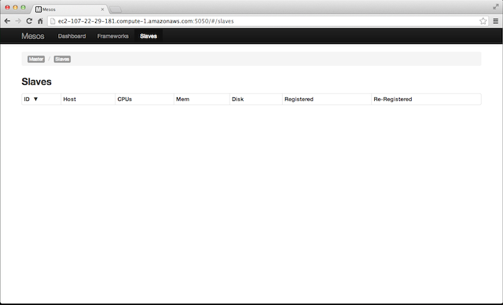
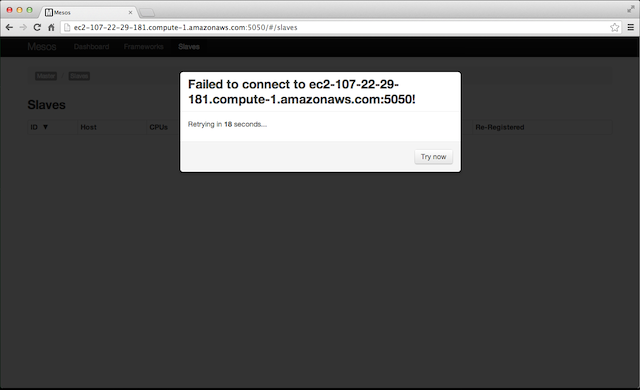
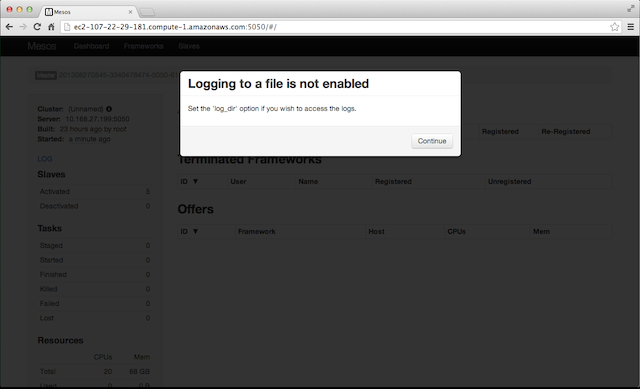
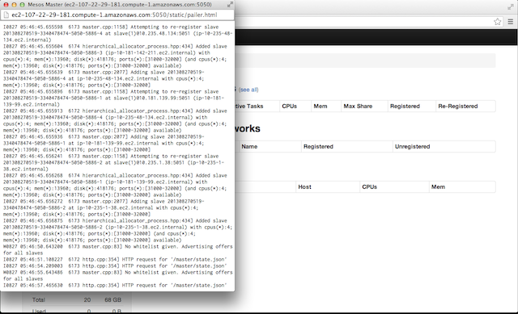
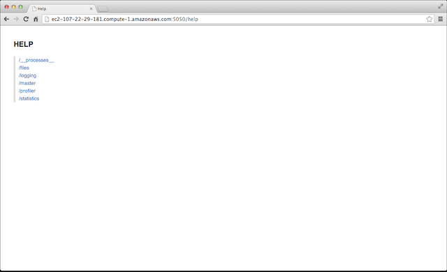
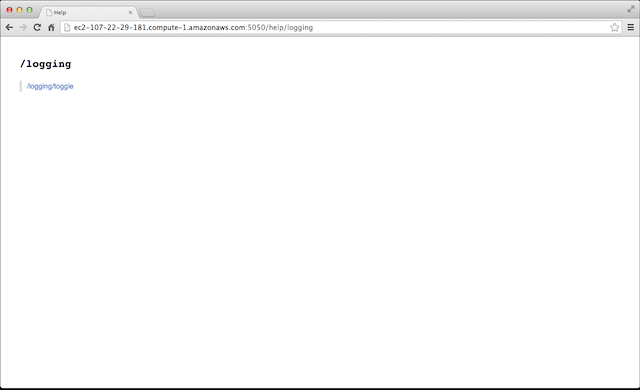
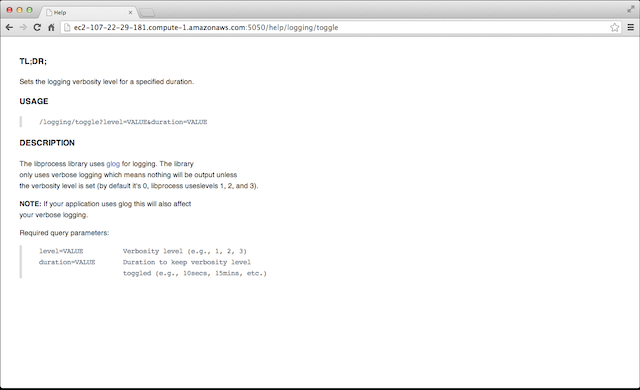
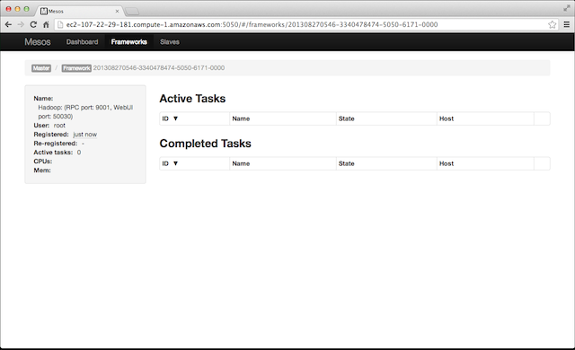

Apache Mesos is ... it consists of masters and slaves ...

You should have been given `master_node_hostname` at the beginning of
the tutorial, or you might have [launched your own
cluster](launching-a-cluster.html) and made a note of it then.

You'll also need the ZooKeeper hostnames and ports.

Start by logging into `master_node_hostname` ...

### Command Line Flags ###

The master and slaves can be configured using command line
flags. There is not a configuration file for Mesos, but any command
line flag can be passed via an environment variable prefixed with
`MESOS_`.

1. Use `--help` to see the available flags:

   <pre class="prettyprint lang-bsh">
   $ mesos-master --help</pre>

   

   <pre class="prettyprint lang-bsh">
   Usage: mesos-master [...]

   Supported options:
     --allocation_interval=VALUE     Amount of time to wait between performing
                                      (batch) allocations (e.g., 500ms, 1sec, etc) (default: 1secs)
     --cluster=VALUE                 Human readable name for the cluster,
                                     displayed in the webui
     --framework_sorter=VALUE        Policy to use for allocating resources
                                     between a given user's frameworks. Options
                                     are the same as for user_allocator (default: drf)
     --[no-]help                     Prints this help message (default: false)
     --ip=VALUE                      IP address to listen on
     --log_dir=VALUE                 Location to put log files (no default, nothing
                                     is written to disk unless specified;
                                     does not affect logging to stderr)
     --logbufsecs=VALUE              How many seconds to buffer log messages for (default: 0)
     --port=VALUE                    Port to listen on (default: 5050)
     --[no-]quiet                    Disable logging to stderr (default: false)
     --roles=VALUE                   A comma seperated list of the allocation
                                     roles that frameworks in this cluster may
                                     belong to.
     --[no-]root_submissions         Can root submit frameworks? (default: true)
     --slaves=VALUE                  Initial slaves that should be
                                     considered part of this cluster
                                     (or if using ZooKeeper a URL) (default: *)
     --user_sorter=VALUE             Policy to use for allocating resources
                                     between users. May be one of:
                                       dominant_resource_fairness (drf) (default: drf)
     --webui_dir=VALUE               Location of the webui files/assets (default: /usr/local/share/mesos/webui)
     --weights=VALUE                 A comma seperated list of role/weight pairs
                                     of the form 'role=weight,role=weight'. Weights
                                     are used to indicate forms of priority.
     --whitelist=VALUE               Path to a file with a list of slaves
                                     (one per line) to advertise offers for;
                                     should be of the form: file://path/to/file (default: *)
     --zk=VALUE                      ZooKeeper URL (used for leader election amongst masters)
                                     May be one of:
                                       zk://host1:port1,host2:port2,.../path
                                       zk://username:password@host1:port1,host2:port2,.../path
                                       file://path/to/file (where file contains one of the above) (default: )</pre>
   

   <pre class="prettyprint lang-bsh">
   $ mesos-slave --help</pre>

   

   <pre class="prettyprint lang-bsh">
   Usage: mesos-slave [...]

   Supported options:
     --attributes=VALUE                         Attributes of machine
     --[no-]checkpoint                          Whether to checkpoint slave and frameworks information
                                                to disk. This enables a restarted slave to recover
                                                status updates and reconnect with (--recover=reconnect) or
                                                kill (--recover=kill) old executors (default: false)
     --default_role=VALUE                       Any resources in the --resources flag that
                                                omit a role, as well as any resources that
                                                are not present in --resources but that are
                                                automatically detected, will be assigned to
                                                this role. (default: *)
     --disk_watch_interval=VALUE                Periodic time interval (e.g., 10secs, 2mins, etc)
                                                to check the disk usage (default: 1mins)
     --executor_registration_timeout=VALUE      Amount of time to wait for an executor
                                                to register with the slave before considering it hung and
                                                shutting it down (e.g., 60secs, 3mins, etc) (default: 1mins)
     --executor_shutdown_grace_period=VALUE     Amount of time to wait for an executor
                                                to shut down (e.g., 60secs, 3mins, etc) (default: 5secs)
     --frameworks_home=VALUE                    Directory prepended to relative executor URIs (default: )
     --gc_delay=VALUE                           Maximum amount of time to wait before cleaning up
                                                executor directories (e.g., 3days, 2weeks, etc).
                                                Note that this delay may be shorter depending on
                                                the available disk usage. (default: 1weeks)
     --hadoop_home=VALUE                        Where to find Hadoop installed (for
                                                fetching framework executors from HDFS)
                                                (no default, look for HADOOP_HOME in
                                                environment or find hadoop on PATH) (default: )
     --[no-]help                                Prints this help message (default: false)
     --ip=VALUE                                 IP address to listen on
     --isolation=VALUE                          Isolation mechanism, may be one of: process, cgroups (default: process)
     --launcher_dir=VALUE                       Location of Mesos binaries (default: /usr/local/libexec/mesos)
     --log_dir=VALUE                            Location to put log files (no default, nothing
                                                is written to disk unless specified;
                                                does not affect logging to stderr)
     --logbufsecs=VALUE                         How many seconds to buffer log messages for (default: 0)
     --master=VALUE                             May be one of:
                                                  zk://host1:port1,host2:port2,.../path
                                                  zk://username:password@host1:port1,host2:port2,.../path
                                                  file://path/to/file (where file contains one of the above)
     --port=VALUE                               Port to listen on (default: 5051)
     --[no-]quiet                               Disable logging to stderr (default: false)
     --recover=VALUE                            Whether to recover status updates and reconnect with old executors.
                                                Valid values for 'recover' are
                                                reconnect: Reconnect with any old live executors.
                                                cleanup  : Kill any old live executors and exit.
                                                           Use this option when doing an incompatible slave
                                                           or executor upgrade!).
                                                NOTE: If checkpointed slave doesn't exist, no recovery is performed
                                                      and the slave registers with the master as a new slave. (default: reconnect)
     --resource_monitoring_interval=VALUE       Periodic time interval for monitoring executor
                                                resource usage (e.g., 10secs, 1min, etc) (default: 5secs)
     --resources=VALUE                          Total consumable resources per slave, in
                                                the form 'name(role):value;name(role):value...'.
     --[no-]strict                              If strict=true, any and all recovery errors are considered fatal.
                                                If strict=false, any expected errors (e.g., slave cannot recover
                                                information about an executor, because the slave died right before
                                                the executor registered.) during recovery are ignored and as much
                                                state as possible is recovered.
                                                (default: false)
     --[no-]switch_user                         Whether to run tasks as the user who
                                                submitted them rather than the user running
                                                the slave (requires setuid permission) (default: true)
     --work_dir=VALUE                           Where to place framework work directories
                                                (default: /tmp/mesos)</pre>
   

------------------------------------------------------------------------

### Web Interface ###

A web interface is available on the master. The default port is `5050`
but that can be changed via the `--port` option. _Note that the port
used for the web interface is the same as the port the slaves use to
connect to the master!_

1. Open your favorite browser and go to the following URL:

   `http://<master_node_hostname>:5050`

   

   
   

2. In the left hand column you'll notice there aren't any activated
slaves. Click `Slaves` in the top navigation bar:

   

   
   

3. TODO(benh): Highlight anything else in the web interface yet?

**NOTE:** _The web interface updates automagically so keep it up as
we'll return to it throughout the rest of this training._

------------------------------------------------------------------------

### High Availability ###

Multiple masters can be run simultaneously in order to provide high
availability (i.e., if one master fails, another will take over). The
current implementation relies on Apache ZooKeeper to perform leader
election between the masters. Each slave can also use ZooKeeper to
find the leading master. To start a master that uses ZooKeeper use the
`--zk` option:

<pre class="prettyprint lang-bsh">
--zk=VALUE                      ZooKeeper URL (used for leader election amongst masters)
                                May be one of:
                                  zk://host1:port1,host2:port2,.../path
                                  zk://username:password@host1:port1,host2:port2,.../path
                                  file://path/to/file (where file contains one of the above) (default: )</pre>

To start a slave that uses ZooKeeper to determine the leading master
use the `--master` option:

<pre class="prettyprint lang-bsh">
--master=VALUE                             May be one of:
                                             zk://host1:port1,host2:port2,.../path
                                             zk://username:password@host1:port1,host2:port2,.../path
                                             file://path/to/file (where file contains one of the above)</pre>

**NOTE:** _Use_ `file://` _when using authentication (i.e.,_
`username:password`_) to avoid revealing your secrets on the command
line!_

We've already launched a ZooKeeper cluster for you and started the
slaves with ZooKeeper. We'll simulate a master failover by restarting
the master to use ZooKeeper as well.

1. Kill the running master:

   <pre class="prettyprint lang-bsh">
   $ killall mesos-master</pre>

   If you didn't close your browser window, return to it now:

   

   
   

2. Restart the master with the `--zk` option:

   <pre class="prettyprint lang-bsh">
   $ nohup mesos-master --zk=zk://.../mesos >/dev/null 2>&1 &</pre>

   Your browser window should now display connected slaves:

   

   
   

**NOTE:** _You can use the high availability of Mesos to perform
backwards compatible upgrades without any downtime!_

------------------------------------------------------------------------

### Logs ###

By default, _a Mesos master and slave log to standard error_. You can
additionally log to the filesystem by setting the `--log_dir` option:

<pre class="prettyprint lang-bsh">
--log_dir=VALUE                 Location to put log files (no default, nothing
                                is written to disk unless specified;</pre>

1. Switch back to your browser and click on the `LOG` link in the left
hand column:

   

   
   

   Ah ha! Let's restart the master using the `--log_dir` option.

   <pre class="prettyprint lang-bsh">
   $ killall mesos-master
   $ mesos-master --log_dir=/var/log/mesos >/dev/null 2>&1 &</pre>

   Now click on the `LOG` link again:

   

   
   

**NOTE:** _The web interface is simply paging/tailing the logs from_
`/var/log/mesos/mesos-master.INFO`_, which you can do as well using_
`tail` _and/or_ `less`_._

------------------------------------------------------------------------

### REST Interface ###

The Mesos masters and slaves provide a handful of REST endpoints that
can be useful for operators. A collection of "help" pages are
available for some of them (our version of `man` for REST).

1. Go to `http://<master_node_hostname>:5050/help` in your browser to
see all of the available endpoints:

   

   
   

2. You can get more details about an endpoint or nested endpoints by
clicking on one; click on `/logging`:

   

   
   

3. Now click on `/logging/toggle` to see the help page:

   

   
   

4. Let's toggle the verbosity level of the master:

   <pre class="prettyprint lang-bsh">
   $ curl 'http://master_node_hostname:5050/logging/toggle?level=3&duration=1mins'</pre>

   

   <pre class="prettyprint lang-bsh">
   ... what is the output?</pre>
   

   If you switch to (or open) the popup window from clicking `LOG` you
   should see a lot more output now (but only for another minute).

5. The web interface uses the REST endpoints exclusively; get the
current "state" of a Mesos cluster (in JSON):

   <pre class="prettyprint lang-bsh">
   $ curl `http://master_node_hostname:5050/master/state.json`</pre>

   

   <pre class="prettyprint lang-bsh">
   ... what is the output here?</pre>
   

------------------------------------------------------------------------

### Frameworks ###

Mesos isn't very useful unless you run some frameworks! We'll now walk
through launching Apache Hadoop and Spark on Mesos.

For now, it's expected that you run framework schedulers independently
of Mesos itself. You can often reuse your master machine(s) for this
purpose.

#### Hadoop ####

We downloaded a Hadoop distribution including support for Mesos
already. See `github.com/mesos/hadoop` for more details on how to
create (or download) a Hadoop distribution including Mesos.

1. You **DO NOT** need to install Hadoop on every node in your
cluster. Instead, upload the Hadoop distribution to `HDFS` so it can
downloaded and used throughout the cluster (we already started `HDFS`
for you):

   <pre class="prettyprint lang-bsh">
   $ hadoop/bin/hadoop fs -put ... ...</pre>

2. Launch Hadoop (i.e., the `JobTracker`):

   <pre class="prettyprint lang-bsh">
   $ cd hadoop
   $ hadoop/bin/hadoop ...</pre>

   The web interface should show Hadoop under `Active Frameworks`:

   

   
   

   Clicking on the link in the `ID` column for Hadoop takes you to a
   page showiing task information:

   

   
   

3. Launch a Hadoop job (using data already on the `HDFS`):

   <pre class="prettyprint lang-bsh">
   $ ...</pre>

   

   <pre class="prettyprint lang-bsh">
   ... what is the output here?</pre>
   

   You should now see some tasks in the web interface:

   

   
   

   Click on `Sandbox` on the far right column of one of the tasks:

   

   
   

   Click on `stdout` in order to see the standard out of this task:

   

   
   

#### Spark ####

1. Like Hadoop, we'll need to upload Spark to `HDFS` before we
begin. But before that we'll need to create a Spark
"distribution":

   <pre class="prettyprint lang-bsh">
   $ cd spark
   $ ./make_distribution.sh
   ...
   $ mv dist spark-0.8.0
   $ tar czf spark-0.8.0.tar.gz spark-0.8.0
   $ hadoop fs -put spark-x.y.z.tar.gz /path/to/spark-x.y.z.tar.gz</pre>

   

   <pre class="prettyprint lang-bsh">
   ... what is the output here?</pre>
   

2. Start the Spark command line interface:

   <pre class="prettyprint lang-bsh">
   $ SPARK_EXECUTOR_URI=hdfs://host:port/path/to/spark-0.8.0.tar.gz \
     MESOS_NATIVE_LIBRARY=/path/to/libmesos.so \
     MASTER=mesos://master_node_hostname:5050 ./spark-shell</pre>

   The web interface should show both Hadoop and Spark under `Active
   Frameworks`:

   

   
   

3. Run a simple Spark query:

   

     

       scala> sc
       res: spark.SparkContext = spark.SparkContext@470d1f30

       scala> val pagecounts = sc.textFile("/wiki/pagecounts")
       12/08/17 23:35:14 INFO mapred.FileInputFormat: Total input paths to process : 74
       pagecounts: spark.RDD[String] = MappedRDD[1] at textFile at <console>:12
       scala> pagecounts.count
     

     

       >>> sc
       <pyspark.context.SparkContext object at 0x7f7570783350>
       >>> pagecounts = sc.textFile("/wiki/pagecounts")
       13/02/01 05:30:43 INFO mapred.FileInputFormat: Total input paths to process : 74
       >>> pagecounts
       <pyspark.rdd.RDD object at 0x217d510>
       >>> pagecounts.count()
     

   

   Like Hadoop, you can check out Spark's tasks and their sandboxes
   via the web interface.
